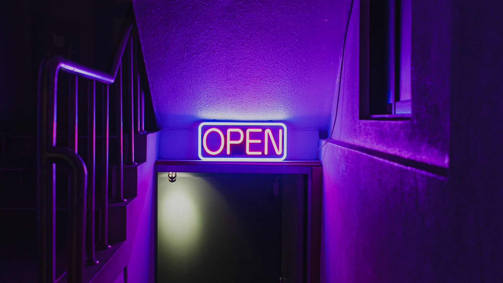
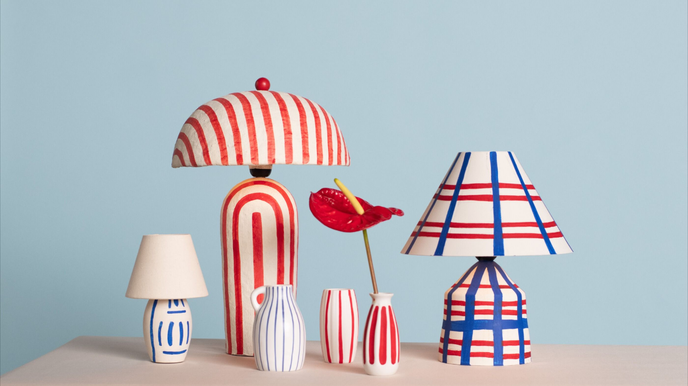
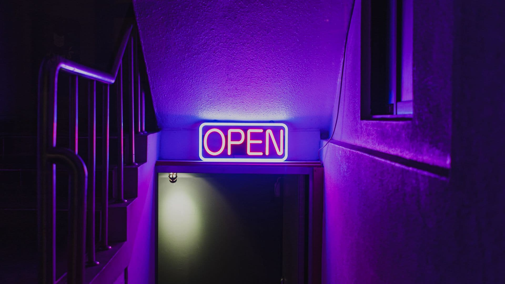
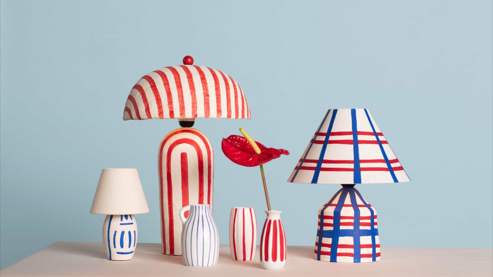
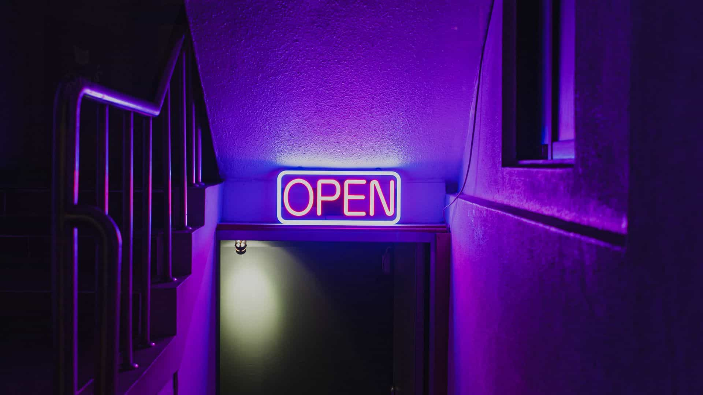
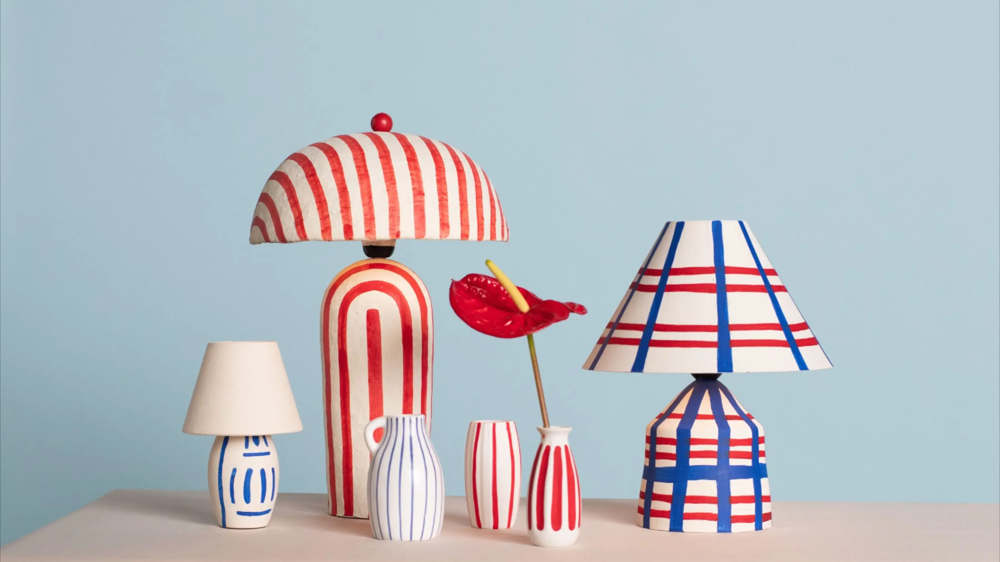
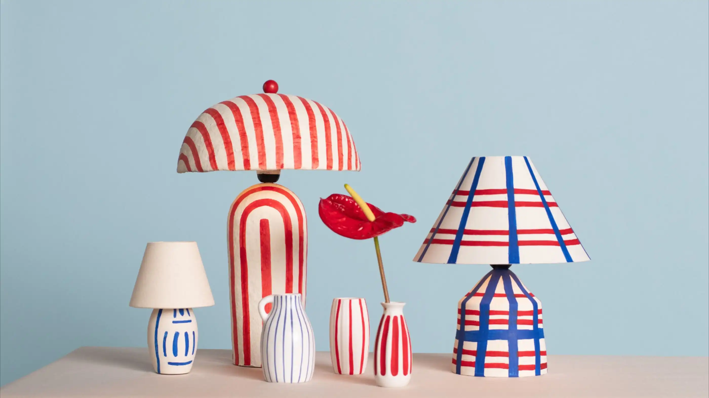
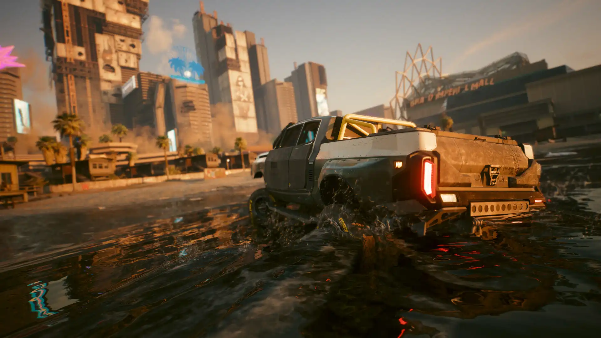
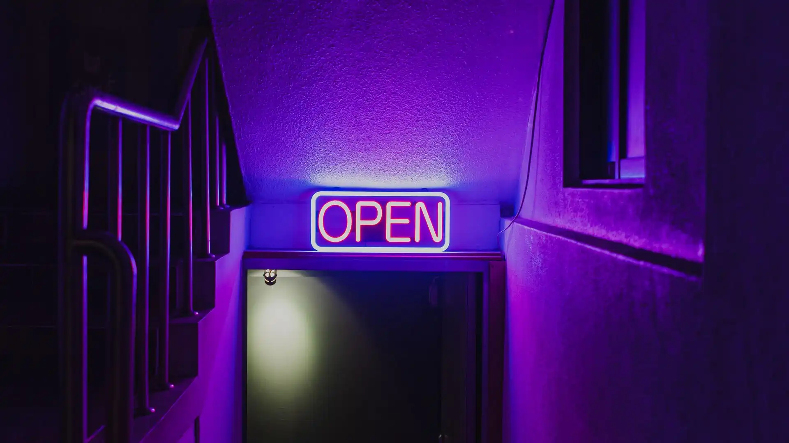
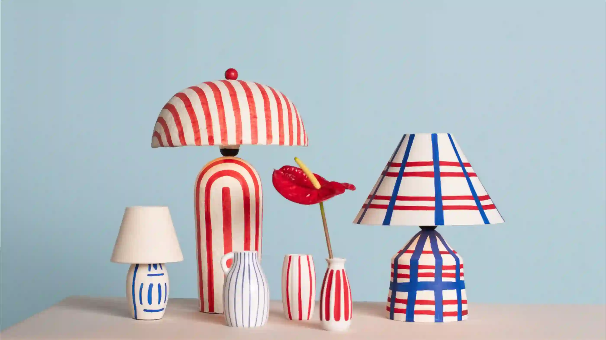

Аналіз вхідних файлів
| Назва зображення| Формат |Розмір (px) | Вага файлу      |
|-----------|--------|------------|---------|
| photo     | jpg    | 2800 x 1575| 246 кб |
| screenshot| png    | 1920 x 1080| 515 кб |
| graphic   | jpg    | 1920 x 1080| 191 кб |

Вихідні зображення:
Оригінальне фото

Оригінальний скріншот

Оригінальна графіка

Lossless стиснення (без втрат) 
WebP

| Назва зображення| Формат |Розмір (px) | Вага файлу | Зміна у % |
|-----------|--------|------------|---------|---------|
| photo     | WebP    | 2800 x 1575| 1437 кб | +484% |
| screenshot| WebP    | 1920 x 1080| 2130 кб | +314% |
| graphic   | WebP   | 1920 x 1080| 1136 кб | +497% |

Оптимізовані зображення WebP:

PNG
| Назва зображення| Формат |Розмір (px) | Вага файлу | Зміна у % |
|-----------|--------|------------|---------|---------|
| photo1     | PNG    | 2800 x 1575| 3349 кб | +1350% |
| screenshot1 | PNG    | 1920 x 1080| 3565 кб | +551% |
| graphic1   | PNG   | 1920 x 1080| 2368 кб | +1144% |

lossy (MozJPEG 100%)
| Назва зображення| Формат |Розмір (px) | Вага файлу | Зміна у % |
|-----------|--------|------------|---------|---------|
| photo2     | JPG    | 2800 x 1575| 786 кб | +219% |
| screenshot2 | JPG    | 1920 x 1080| 850 кб | +65% |
| graphic2  | JPG   | 1920 x 1080| 786 кб | +313% |

MozJPEG 75%
| Назва зображення| Формат |Розмір (px) | Вага файлу | Зміна у % |
|-----------|--------|------------|---------|---------|
| photo3     | JPG    | 2800 x 1575| 166 кб | -33% |
| screenshot3 | JPG    | 1920 x 1080| 164 кб | -69% |
| graphic3  | JPG   | 1920 x 1080| 137 кб | -30% |

MozJPEG 50%
| Назва зображення| Формат |Розмір (px) | Вага файлу | Зміна у % |
|-----------|--------|------------|---------|---------|
| photo4     | JPG    | 2800 x 1575| 99.7 кб | -60% |
| screenshot4 | JPG    | 1920 x 1080| 97.1 кб | -82% |
| graphic4  | JPG   | 1920 x 1080| 77.2 кб | -60% |

MozJPEG мінімальний рівень якості
| Назва зображення| Формат |Розмір (px) | Вага файлу | Зміна у % | Якість |
|-----------|--------|------------|---------|---------|-------|
| photo5     | JPG    | 2800 x 1575| 63.6 кб | -75% | 23% |
| screenshot5 | JPG    | 1920 x 1080| 62.4 кб | -88% | 21% |
| graphic5  | JPG   | 1920 x 1080| 36.5 кб | -81% | 19% |

WebP 100%
| Назва зображення| Формат |Розмір (px) | Вага файлу | Зміна у % |
|-----------|--------|------------|---------|---------|
| photo6     | WEBP    | 2800 x 1575| 487 кб | +93% |
| screenshot6 | WEBP    | 1920 x 1080| 381 кб | +95% |
| graphic6  | WEBP   | 1920 x 1080| 604 кб | +15% |

WebP 75%
| Назва зображення| Формат |Розмір (px) | Вага файлу | Зміна у % |
|-----------|--------|------------|---------|---------|
| photo7     | WEBP    | 2800 x 1575| 76.5 кб | -70% |
| screenshot7 | WEBP    | 1920 x 1080| 111 кб | -79% |
| graphic7  | WEBP   | 1920 x 1080| 86.9 кб | -55% |

WebP 50%
| Назва зображення| Формат |Розмір (px) | Вага файлу | Зміна у % |
|-----------|--------|------------|---------|---------|
| photo8     | WEBP    | 2800 x 1575| 57.0 кб | -77% |
| screenshot8 | WEBP    | 1920 x 1080| 79.4 кб | -85% |
| graphic8  | WEBP   | 1920 x 1080| 62.0 кб | -68% |

WebP мінімальна якість
| Назва зображення| Формат |Розмір (px) | Вага файлу | Зміна у % | Якість |
|-----------|--------|------------|---------|---------|-------|
| photo9     | JPG    | 2800 x 1575| 32.4 кб | -87% | 6% |
| screenshot9 | JPG    | 1920 x 1080| 38.4 кб | -93% | 12% |
| graphic9  | JPG   | 1920 x 1080| 19.9 кб | -90% | 5% |

AVIF 100%
| Назва зображення| Формат |Розмір (px) | Вага файлу | Зміна у % |
|-----------|--------|------------|---------|---------|
| photo10     | AVIF    | 2800 x 1575| 364 кб | +45% |
| screenshot10 | AVIF    | 1920 x 1080| 563 кб | +7% |
| graphic10  | AVIF   | 1920 x 1080| 352 кб | +81% |

AVIF 75%
| Назва зображення| Формат |Розмір (px) | Вага файлу | Зміна у % |
|-----------|--------|------------|---------|---------|
| photo11     | AVIF    | 2800 x 1575| 86.0 кб | -66% |
| screenshot11 | AVIF    | 1920 x 1080| 140 кб | -73% |
| graphic11  | AVIF   | 1920 x 1080| 106 кб | -46% |

AVIF 50%
| Назва зображення| Формат |Розмір (px) | Вага файлу | Зміна у % |
|-----------|--------|------------|---------|---------|
| photo12     | AVIF    | 2800 x 1575| 31.8 кб | -87% |
| screenshot12 | AVIF    | 1920 x 1080| 55.4 кб | -89% |
| graphic12  | AVIF   | 1920 x 1080| 48.7 кб | -75% |

AVIF мінімальна якість
| Назва зображення| Формат |Розмір (px) | Вага файлу | Зміна у % | Якість |
|-----------|--------|------------|---------|---------|-------|
| photo13     | AVIF    | 2800 x 1575| 12.7 кб | -95% | 20% |
| screenshot13 | AVIF    | 1920 x 1080| 37.8 кб | -93% | 39% |
| graphic13  | AVIF   | 1920 x 1080| 6.89 кб | -96% | 17% |

| Назва зображення| Формат | Оригін. розмір | Веб (1200px) | Мобайл (600px) | Retina 2x (2400px) |
|-----------|--------|------------|---------|---------|---------|
| photo14     | jpg    | 245 кб | 949 кб (+277%) | 256 кб (+2%) | 3.32 мб (+1220%) |
| screenshot14 | png    | 514 кб | 1.55 мб (+194%) | 420 кб (-20%) | 5.25 мб (+898%) |
| graphic14  | jpg   | 190 кб | 1.29 мб (+564%) | 376 кб (+93%) | 4.33 мб (+2120%) |

photo14
.png)
.png)
.png)

screenshot14
.png)
.png)
.png)

graphic14
.png)
.png)
.png)

Висновки: 
У ході виконання практичної роботи було досліджено різні методи стиснення зображень та їхній вплив на якість. Було розглянуто два основних типи стиснення:

Стиснення без втрат (lossless) – дозволяє зберегти оригінальну якість зображення, проте незначно зменшує розмір файлу.
Стиснення з втратами (lossy) – значно зменшує вагу файлу, проте може призводити до втрати деталей та появи артефактів.
Також було досліджено, як зміна розміру зображення впливає на його якість і обсяг. Визначено оптимальні параметри для різних застосувань:

Для веб-сайтів – компроміс між якістю та швидкістю завантаження.
Для мобільних пристроїв – використання меншого розміру для економії пам’яті та швидшого завантаження.
Для Retina-дисплеїв – створення версій 2x, 3x для збереження деталізації.

Вибір формату залежить від типу зображення та цільового використання:
1. JPEG (JPG) – найкраще підходить для фотографій та градієнтних зображень. Використовує стиснення з втратами, що дозволяє значно зменшити розмір файлу при прийнятній якості.
2. PNG – оптимальний для зображень із прозорістю (логотипи, іконки, графіка). Використовує стиснення без втрат, зберігаючи всі деталі.
3. WebP – сучасний формат, який підтримує як стиснення без втрат, так і з втратами. Дозволяє отримати менший розмір файлу при збереженні хорошої якості.
4. AVIF – новий формат із кращою компресією, ніж WebP, та високою якістю.

Зміна розміру зображення безпосередньо впливає на його вагу та швидкість завантаження:
1. Зменшення розміру зменшує вагу файлу, що покращує продуктивність сайту та швидкість завантаження.
2. Надмірне зменшення може призвести до втрати деталей та погіршення чіткості.
3. Збільшення розміру (upsampling) не додає нових деталей, а лише розтягує пікселі, що робить зображення розмитим.

Retina-дисплеї мають високу щільність пікселів, тому стандартні зображення можуть виглядати розмитими. Щоб цього уникнути:
1. Використовуйте зображення в 2x або 3x більшій роздільній здатності, ніж їх фактичний розмір на сайті.
2. Для растрових зображень застосовуйте WebP або AVIF із високою якістю.
